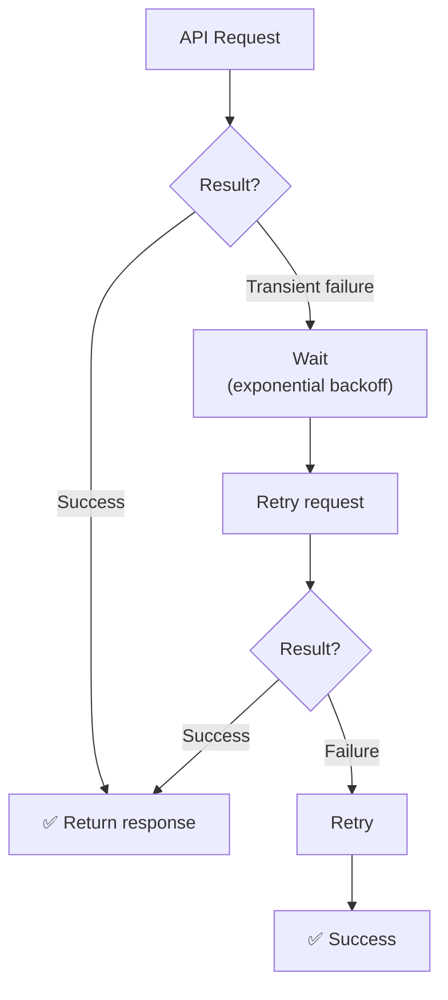
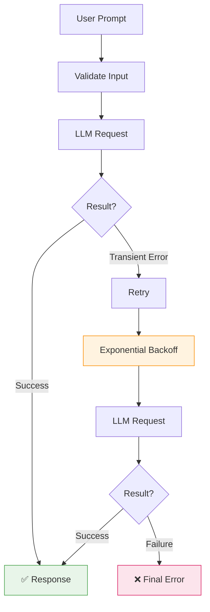

# 🛡️ Bulletproof LLM Wrapper

A resilient Python wrapper for interacting with LLM APIs through **Groq**, designed to handle common transient failures gracefully using automatic retries, exponential backoff, timeout handling, rate-limit handling, and custom exceptions.

The goal of this project is to demonstrate how an LLM integration can be made more reliable than a simple direct API call.

---

## ✨ Features

- 🤖 LLM integration using the Groq Python SDK
- 🔄 Automatic retries for transient API failures
- ⏱️ Request timeout configuration
- 🚦 Rate-limit handling
- 📈 Exponential backoff between retries
- 🧯 Custom application-level exceptions
- 🔐 API key loaded securely from environment variables
- 🧪 Unit tests with mocked API responses
- 📦 Modern Python package structure using `src/`
- 🧩 Separation of configuration, client, LLM logic, retry logic, and exceptions

---

## 🏗️ Architecture

The wrapper separates responsibilities into small, focused modules:

```mermaid
flowchart TD
    APP["Application"] --> MAIN["main.py"]
    MAIN --> LLM["llm.py"]
    LLM --> CLIENT["client.py"]
    CLIENT --> GROQ["Groq API"]
    LLM --> RETRY["retry.py"]
    RETRY --> T["⏱️ Timeout handling"]
    RETRY --> R["🚦 Rate-limit handling"]
    RETRY --> B["📈 Exponential backoff"]

    CFG["config.py"] -.-> LLM
    CFG -.-> CLIENT
    CFG -.-> RETRY
    CFG --- CFG1["API key · Model · Timeout · Retry config"]

    EXC["exceptions.py"] -.-> LLM
    EXC --- EXC1["Application-level errors"]

    style stroke:#1e88e5
    style stroke:#fb8c00
    style stroke:#d81b60
```

---

## 📁 Project Structure

```text
Bulletproof LLM Wrapper/
│
├── .env
├── pyproject.toml
├── requirements.txt
│
├── src/
│   └── llm_resilience/
│       ├── client.py
│       ├── config.py
│       ├── exceptions.py
│       ├── llm.py
│       ├── main.py
│       └── retry.py
│
└── tests/
    ├── test_llm.py
    └── test_retry.py
```

### Module Responsibilities

| Module | Responsibility |
| --- | --- |
| `config.py` | Loads environment variables and application configuration |
| `client.py` | Creates the Groq API client |
| `llm.py` | Handles prompt validation and LLM requests |
| `retry.py` | Implements retry and exponential backoff behavior |
| `exceptions.py` | Defines custom application exceptions |
| `main.py` | Provides the command-line interface |
| `test_llm.py` | Tests LLM response generation |
| `test_retry.py` | Tests retry behavior |

---

## 🔄 Retry & Resilience

The core resilience mechanism is implemented using **[Tenacity](https://github.com/jd/tenacity)**.

The wrapper currently retries the following transient errors:

- `APITimeoutError`
- `RateLimitError`

The retry policy allows up to **3 attempts**.

### Exponential Backoff

The retry configuration uses exponential backoff:

```python
wait_exponential(
    multiplier=1,
    min=2,
    max=10
)
```

This prevents the application from immediately sending repeated requests when an external service is temporarily unavailable.

Conceptually:



The retry function also logs before sleeping, making retry behavior observable during execution.

---

## 🧯 Error Handling

The project defines application-level exceptions rather than exposing provider-specific failures directly to the application layer.

```python
class LLMError(Exception):
    pass


class LLMServiceUnavailableError(LLMError):
    pass
```

Provider-level API errors are converted into `LLMServiceUnavailableError`, allowing the rest of the application to work with a consistent application-level exception.

For example:

```python
try:
    result = generate_response(prompt)
except LLMServiceUnavailableError:
    print("The AI service is temporarily unavailable.")
```

---

## 🔐 Configuration

The API key is loaded from an environment variable using `python-dotenv`.

Create a `.env` file in the project root:

```env
GROQ_API_KEY=your_api_key_here
```

⚠️ **Never commit your real API key**

Make sure `.env` is included in `.gitignore`:

```text
.env
venv/
__pycache__/
.pytest_cache/
*.egg-info/
```

### ⚙️ Current Configuration

The application currently uses the following settings (defined in `config.py`):

| Setting | Value |
| --- | --- |
| Model | `openai/gpt-oss-20b` |
| Request timeout | 5 seconds |
| Maximum attempts | 3 |
| Backoff multiplier | 1 |
| Minimum backoff | 2 seconds |
| Maximum backoff | 10 seconds |

---

## 🚀 Installation

### 1. Clone the repository

```bash
git clone https://github.com/PUNITH-V/WorkBench.git
cd WorkBench/Bulletproof\ LLM\ Wrapper
```

On Windows PowerShell:

```powershell
git clone https://github.com/PUNITH-V/WorkBench.git
cd "WorkBench\Bulletproof LLM Wrapper"
```

### 2. Create a virtual environment

```bash
python -m venv venv
```

### 3. Activate the virtual environment

```powershell
.\venv\Scripts\Activate.ps1
```

If PowerShell blocks script execution for the current session:

```powershell
Set-ExecutionPolicy -Scope Process -ExecutionPolicy RemoteSigned
```

Then activate again:

```powershell
.\venv\Scripts\Activate.ps1
```

### 4. Install dependencies

```bash
pip install -r requirements.txt
```

You can also install the project in editable mode:

```bash
pip install -e .
```

---

## ▶️ Running the Application

Make sure your virtual environment is active and your `GROQ_API_KEY` is configured.

Run:

```bash
python -m llm_resilience.main
```

The application will prompt you for a question:

```text
🤖 AI Assistant
========================================

Ask the AI something: What is machine learning?

⏳ Generating response...

🤖 AI:
Machine learning is a branch of artificial intelligence...
```

---

## 🧪 Testing

The project uses **pytest**.

Run all tests:

```bash
pytest -v
```

The test suite covers:

**LLM response generation**
`test_llm.py` mocks the LLM client and verifies that the generated response is returned correctly.

```text
test_generate_response PASSED
```

**Retry behavior**
`test_retry.py` simulates two consecutive timeouts followed by a successful response:

```text
Attempt 1 → APITimeoutError
Attempt 2 → APITimeoutError
Attempt 3 → Success
```

It verifies both the final result and the number of API calls:

```python
assert result == "Success"
assert mock_api.call_count == 3
```

This ensures the retry mechanism is actually performing the expected number of attempts.

---

## 🧠 Why This Project?

A basic LLM integration often looks like:

```python
response = client.chat.completions.create(...)
```

That works when everything goes well.

Real-world applications, however, need to account for temporary problems such as:

- Network timeouts
- API rate limits
- Temporary service failures
- Invalid user input
- Provider-specific exceptions

This project explores how to introduce a **resilience layer** between the application and the external LLM service. Instead of allowing transient failures to immediately reach the user, the wrapper attempts to recover automatically when appropriate.

---

## 🛡️ Resilience Strategy



This provides a foundation for making LLM-powered applications more reliable.

---

## 🧰 Technologies

- Python 3.11+
- Groq Python SDK
- Tenacity — retry and backoff handling
- python-dotenv — environment configuration
- pytest — testing
- unittest.mock — API mocking

---

## 👨‍💻 Author

**PUNITH-V**

Built as a practical exploration of resilient LLM application architecture, API failure handling, and production-oriented Python development.