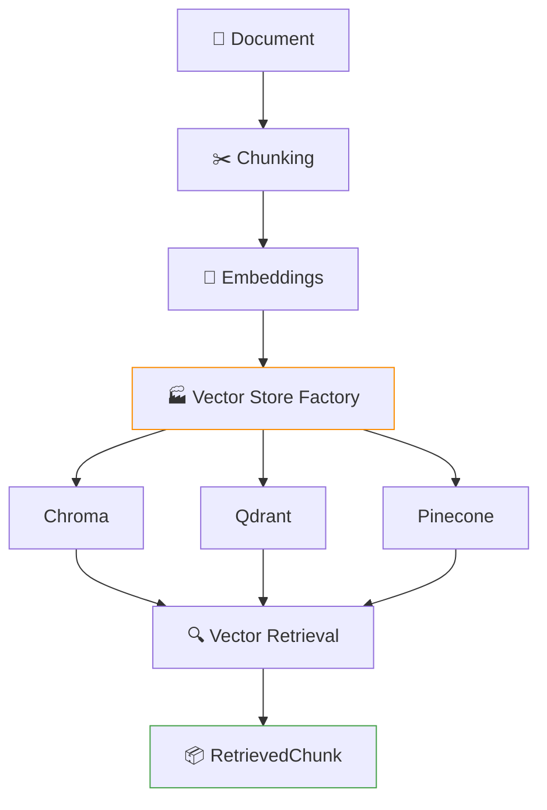
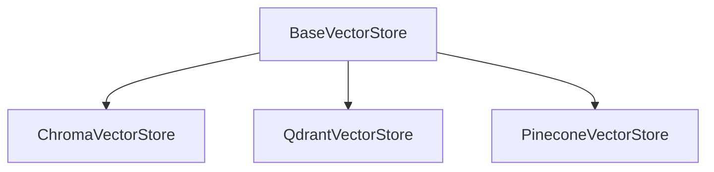

# 🧬 VectorForge

> Modular Document Ingestion & Multi-Vector Database Pipeline

**VectorForge** is a modular RAG foundation project designed to explore how the same embedding and retrieval workflow can work across multiple vector databases.

The project focuses on **clean abstractions, interchangeable vector-store backends, metadata filtering, embeddings, configuration management, and automated testing**.

---

## 🎯 Project Goal

The goal of VectorForge is to understand how vector databases fit into a modern RAG pipeline while keeping the application independent of any single vector database.

The same application can switch between:

- ChromaDB
- Qdrant
- Pinecone

without changing the rest of the retrieval pipeline.

---

## 🏗️ Architecture



The vector database implementations follow a common interface, allowing the backend to be changed through configuration.

---

## 📁 Project Structure

```text
Modular Document Ingestion & Multi-Vector Database Pipeline/
│
├── app/
│   ├── config/
│   │   └── settings.py
│   │
│   ├── chunking/
│   │   └── chunker.py
│   │
│   ├── embeddings/
│   │   └── embedder.py
│   │
│   ├── schemas/
│   │   └── retrieval.py
│   │
│   ├── vector_stores/
│   │   ├── base.py
│   │   ├── chroma.py
│   │   ├── pinecone.py
│   │   ├── qdrant.py
│   │   └── factory.py
│   │
│   └── main.py
│
├── data/
├── tests/
├── .env
├── .gitignore
└── requirements.txt
```

---

## 🔑 Key Features

### Modular Vector Store Architecture

A common `BaseVectorStore` abstraction is used by all vector database implementations.



This keeps the application code independent of individual database APIs.

### Multiple Vector Databases

VectorForge currently supports:

**ChromaDB**
- Local persistent vector storage
- Useful for local development and experimentation

**Qdrant**
- Local persistent storage
- Supports vector similarity search and metadata filtering

**Pinecone**
- Hosted vector database
- Supports cloud-based vector storage and retrieval

### Free Local Embeddings

The project uses `all-MiniLM-L6-v2` through Sentence Transformers.

This allows embeddings to be generated locally without relying on a paid embedding API.

### Metadata Filtering

Documents are stored with metadata such as:

```python
{
    "document_id": "doc1",
    "source": "test",
    "chunk_index": 0
}
```

Queries can optionally filter results by metadata:


### Standardized Retrieval Schema

Regardless of which vector database is used, retrieval results are converted into:

```python
class RetrievedChunk(BaseModel):
    chunk: str
    metadata: dict
    score: float
```

This keeps downstream code independent of the vector database.

### Configuration-Based Backend Switching

The active vector store is selected through configuration:

```python
VECTOR_STORE = "chroma"
```

Possible values: `chroma`, `qdrant`, `pinecone`

No retrieval logic needs to change when switching databases.

---

## ⚙️ Configuration

Create a `.env` file for credentials when using Pinecone:

```env
PINECONE_API_KEY=your_api_key
```

The Pinecone API key is optional when using ChromaDB or Qdrant. The application only requires Pinecone credentials when `VECTOR_STORE = "pinecone"`.

---

## 🚀 Running the Project

Create and activate a virtual environment:

```bash
python -m venv venv
```

Activate it on Windows:

```powershell
venv\Scripts\activate
```

Install dependencies:

```bash
pip install -r requirements.txt
```

Run the application:

```bash
python -m app.main
```

The application will ask for:

```text
Document ID
Document text
Query
Optional document ID filter
```

---

## 🧪 Testing

The project uses `pytest`.

Run the complete test suite:

```bash
pytest -v
```

Current tests cover:

- Chunking
- Embedding generation
- Input validation
- ChromaDB storage and retrieval
- ChromaDB metadata filtering
- Qdrant storage and retrieval
- Qdrant metadata filtering
- Pinecone retrieval
- Pinecone metadata filtering

The Pinecone tests use a mocked index for retrieval tests, so the test suite does not require a live Pinecone request.

---

## 🧠 Design Principles

VectorForge was built around several principles:

**1. Separation of concerns**

| Component | Responsibility |
| --- | --- |
| Chunker | Splits documents |
| Embedder | Creates vectors |
| Vector Store | Stores and retrieves vectors |
| Schema | Standardizes retrieved data |
| Factory | Selects the backend |
| Config | Controls application settings |

**2. Backend independence** — Application logic should not depend directly on a specific vector database.

**3. Explicit interfaces** — Vector stores implement a shared interface rather than exposing their database-specific APIs to the rest of the application.

**4. Testability** — External services and database implementations are tested independently where possible.

**5. Configuration over hard-coding** — Backend selection and model configuration are kept outside the core application logic.

---

## 🔮 Future Extensions

This project intentionally stops at the vector retrieval foundation.

Possible future projects can build on top of it with:

- PDF and DOCX document ingestion
- More sophisticated document loaders
- Persistent document management
- Hybrid search
- Reranking
- Retrieval evaluation
- RAG generation
- Query rewriting
- Multi-query retrieval
- Context compression
- Observability and tracing
- REST API
- CLI improvements

These features are intentionally kept separate so that VectorForge remains focused on understanding the **vector storage and retrieval layer**.

---

## 🛠️ Technologies

- Python
- Sentence Transformers
- ChromaDB
- Qdrant
- Pinecone
- Pydantic
- Pydantic Settings
- LangChain Text Splitters
- Pytest

---

## 📌 Status

**Completed — Vector Retrieval Foundation**

The current version focuses on understanding and implementing a modular multi-vector-database architecture rather than building a complete RAG application.

---

## 👤 Author

**PUNITH-V**

Part of the **WorkBench** repository — a collection of projects built to learn, experiment, and develop production-oriented AI engineering skills.
