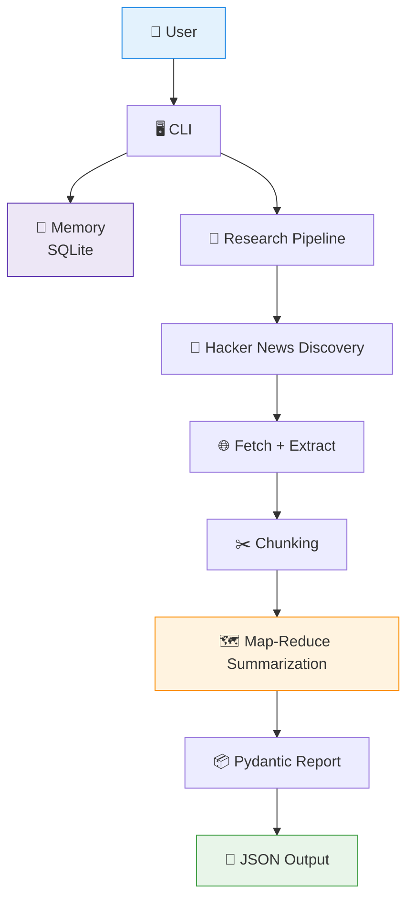
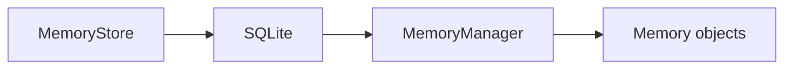
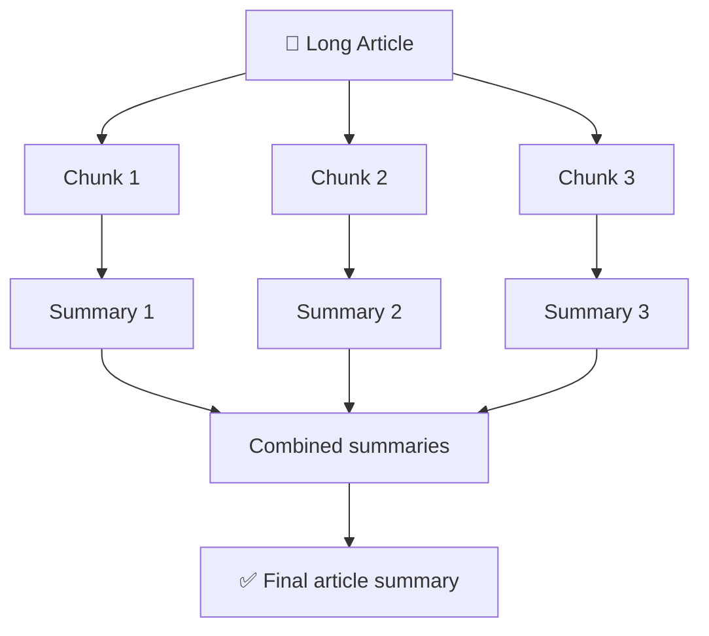

# 🔎 Sift

> **Scrape. Process. Validate. Store.**

**Sift** is a resilient CLI research assistant that searches Hacker News, extracts article content, processes long documents using Map-Reduce summarization, validates structured results with Pydantic, and stores research reports as JSON.

Built as a Week 1 capstone focused on practical AI engineering and production-oriented software design.

---

## ✨ Features

- 🔎 **Hacker News research** — Search Hacker News for a given topic
- 🌐 **Web scraping** — Fetch and extract readable article content
- ✂️ **Smart chunking** — Split long articles into manageable overlapping chunks
- 🗺️ **Map-Reduce summarization** — Summarize large articles in multiple stages
- 🤖 **LLM abstraction** — Provider-independent LLM interface
- 🛡️ **Retry handling** — Automatically retries network and timeout failures
- 📦 **Structured output** — Validate research reports using Pydantic
- 🧠 **Persistent memory** — Store recent user interactions using SQLite
- 👤 **User recognition** — Remember the most recently used user across sessions
- 💾 **JSON reports** — Save completed research reports to disk
- 🖥️ **CLI interface** — Simple terminal-based interaction

---

## 🏗️ Architecture



---

## 📁 Project Structure

```text
Sift/
│
├── app/
│   ├── main.py
│   │
│   ├── cli/
│   │   └── interface.py
│   │
│   ├── config/
│   │   └── settings.py
│   │
│   ├── memory/
│   │   ├── models.py
│   │   ├── store.py
│   │   └── manager.py
│   │
│   ├── scraper/
│   │   ├── hackernews.py
│   │   ├── fetcher.py
│   │   ├── extractor.py
│   │   └── models.py
│   │
│   ├── llm/
│   │   ├── client.py
│   │   ├── groq_client.py
│   │   ├── mistral_client.py
│   │   ├── openrouter_client.py
│   │   ├── retry.py
│   │   └── prompts.py
│   │
│   ├── processing/
│   │   ├── chunker.py
│   │   ├── map_reduce.py
│   │   ├── summarizer.py
│   │   └── research_summary.py
│   │
│   ├── schemas/
│   │   └── research.py
│   │
│   ├── output/
│   │   └── writer.py
│   │
│   └── pipeline.py
│
├── data/
│   └── sift.db
│
├── output/
│   └── research_report.json
│
├── tests/
│   ├── unit/
│   ├── integration/
│   └── fixtures/
│
├── .env
├── .gitignore
├── pyproject.toml
└── README.md
```

---

## ⚙️ Tech Stack

| Technology | Purpose |
| --- | --- |
| **Python** | Core application |
| **SQLite** | Persistent memory |
| **Pydantic** | Data validation and schemas |
| **Requests** | HTTP requests |
| **BeautifulSoup** | HTML parsing |
| **Trafilatura** | Article content extraction |
| **Tenacity** | Retry handling |
| **Groq / Mistral / OpenRouter** | LLM providers |

---

## 🚀 Getting Started

### 1. Clone the repository

```bash
git clone https://github.com/PUNITH-V/WorkBench.git
cd WorkBench/Sift
```

### 2. Create a virtual environment

```bash
python -m venv venv
```

Activate it on Windows:

```powershell
venv\Scripts\Activate.ps1
```

### 3. Install dependencies

```bash
pip install -r requirements.txt
```

Or, if the project is configured through `pyproject.toml`:

```bash
pip install -e .
```

### 4. Configure environment variables

Create a `.env` file in the project root.

Example:

```env
GROQ_API_KEY=your_key_here
MISTRAL_API_KEY=your_key_here
OPENROUTER_API_KEY=your_key_here
```

⚠️ Never commit `.env` or API keys to Git.

---

## ▶️ Running Sift

Start the CLI with:

```bash
python -m app.main
```

On the first run:

```text
Sift — Research Assistant
What's your name? Spideyboy

Research topic (or 'exit'): AI agents
```

On subsequent runs, Sift can retrieve the stored user name:

```text
Sift — Research Assistant
Welcome back, Spideyboy!

Research topic (or 'exit'):
```

---

## 🔬 Example Workflow

For a topic such as:

```text
AI agents
```

Sift:

1. Searches Hacker News
2. Finds relevant articles
3. Fetches the article pages
4. Extracts readable text
5. Splits long articles into overlapping chunks
6. Summarizes each chunk
7. Combines the chunk summaries
8. Generates an overall research summary
9. Validates the final structure with Pydantic
10. Saves the report as JSON

Example output:

```json
{
  "topic": "AI agents",
  "summary": "Overall research summary...",
  "articles": [
    {
      "title": "Example article",
      "url": "https://example.com",
      "summary": "Article summary..."
    }
  ]
}
```

The report is written to:

```text
output/research_report.json
```

---

## 🧠 Persistent Memory

Sift uses SQLite to persist recent interactions.



Sift currently keeps the **latest 10 memories** using a rolling limit.

The database is stored locally at:

```text
data/sift.db
```

Generated data and output files are excluded from version control.

---

## 🛡️ Reliability

LLM calls are wrapped with retry handling for transient failures such as:

- Connection errors
- Request timeouts
- Network-level failures

The retry policy uses up to **3 attempts** with exponential backoff.

Permanent failures such as provider quota exhaustion are not blindly retried, avoiding unnecessary API requests.

---

## 📄 Structured Output

Research results are represented using Pydantic models.

```python
class ArticleSummary(BaseModel):
    title: str
    url: str
    summary: str


class ResearchReport(BaseModel):
    topic: str
    summary: str
    articles: list[ArticleSummary]
```

This ensures that the final report follows a predictable structure before it is written to disk.

---

## 🧩 Map-Reduce Processing

Long articles can exceed the practical context limits of a single LLM request.



Chunks use overlapping text to reduce the chance of losing information at chunk boundaries.

---

## 🎯 Current Scope

Sift Version 1 intentionally focuses on **Hacker News as the research source**.

The goal is to establish a reliable research pipeline before introducing additional sources or more complex features.

Future versions may explore:

- Additional research sources
- Better source ranking
- More sophisticated memory
- Improved semantic validation
- Parallel article processing
- CLI commands and options
- Automated testing
- Research history
- More advanced LLM routing and fallback strategies

---

## 🧪 Engineering Focus

Sift was built with a focus on practical production engineering concepts:

- Separation of concerns
- Dependency abstraction
- Failure handling
- Structured data validation
- Persistent storage
- Modular pipeline design
- Controlled external API usage
- Graceful handling of failed articles

The project deliberately avoids unnecessary abstraction where a simpler solution is sufficient.

---

## 📌 Project Status

**Core research pipeline complete.**

The current implementation supports the complete flow from user input to persistent memory and validated JSON research output.

---

## 👤 Author

**Punith**

Built as part of the **WorkBench** project collection.

> A place for the things I build, break, and learn from.
