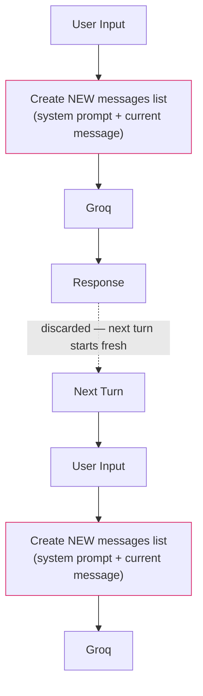
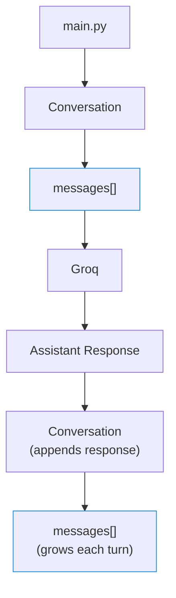
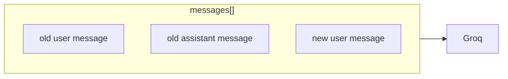
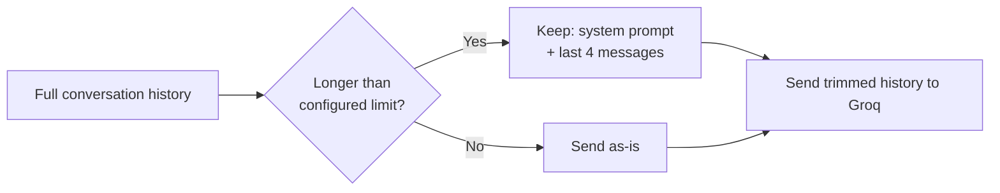

# 🧠 Conversation Memory

This project demonstrates the difference between a **stateless** and a **stateful** LLM chatbot.

---

## 🗂️ Project Structure

```text
conversation_memory/
│
├── common/
│   ├── config.py
│   └── groq_client.py
│
├── stateless/
│   └── main.py
│
├── stateful/
│   ├── main.py
│   ├── conversation.py
│   └── memory.py
│
├── .env
├── .gitignore
├── requirements.txt
└── README.md
```

---

## 🚫 Stateless Bot

The stateless bot does not store conversation history. Every API request contains only:

1. System prompt
2. Current user message

Therefore, previous messages are not remembered.



The previous list is gone.

---

## 🧵 Stateful Bot

The stateful bot stores conversation history in a Python list.

- Every user message is added to the conversation
- Every assistant response is also added
- The entire conversation is sent to the LLM on every request
- This allows the model to respond using previous context



Next turn, the growing history is sent again:



---

## 💾 Memory Management

The stateful bot has a memory limit. When the conversation becomes longer than the configured limit, **the system prompt and the last four messages** are retained.



---

## 🧪 Example Test

### Stateless

```text
You: My name is Alex.
You: What is my name?
```

The bot should **not reliably know** the name, because the previous conversation was not sent with the second request.

### Stateful

```text
You: My name is Alex.
You: I am learning Python.
You: I want to become an AI engineer.
You: What is my name?
```

The stateful bot **should remember** that the name is Alex.

---

## 🔑 Key Lesson

The application is responsible for maintaining conversation state. The LLM does not automatically remember previous API calls — **the application must send the relevant conversation history with each request.**

---

## 📝 Notes

- **Memory trimming:** the memory bonus in the assignment specifies keeping the system prompt plus the last 4 messages, and this implementation follows that literally. In a production chatbot, you'd normally make the trimming **token-aware** and **turn-aware** so you don't accidentally separate a user message from its assistant reply.
- **Model configuration:** use a currently supported Groq model available to your account. The `GROQ_MODEL` environment variable makes this easy to change without modifying your Python code.
